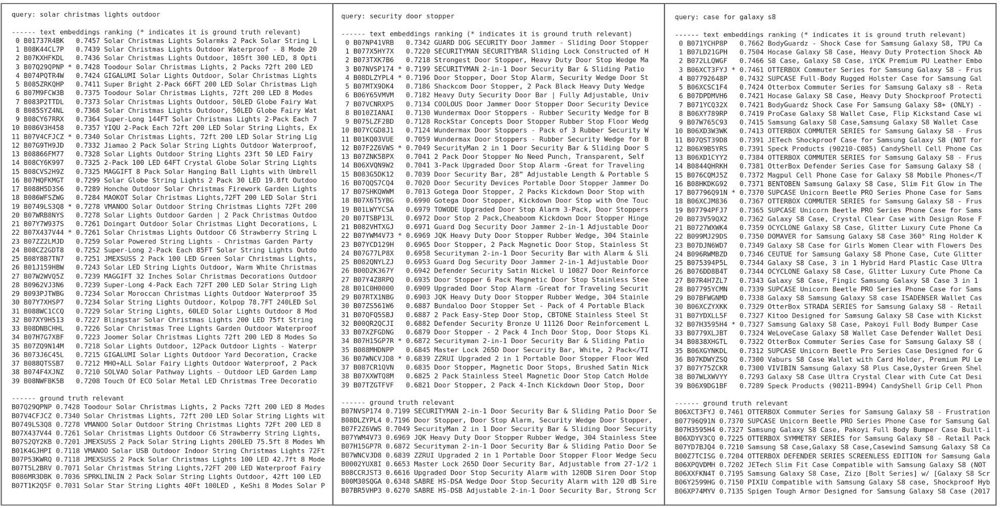

# text embeddings for product retrieval

Use text embeddings to represent both queries and products, and perform dot product to get the most similar products given a query.

We use the [esci](https://github.com/amazon-science/esci-data) dataset, with the following locales

    locale es (spanish) 15180 queries, 259973 products
    locale us (english) 97345 queries, 1215851 products

Results with Gemini `text-embedding-004`

    spanish nDCG 0.6664
    english nDCG 0.6765

## retrieval inspection

The dataset has nice annotations but they are far from complete. In the following three query examples there are many products that clearly match the query but have not been identified as relevant. Comparisons between models in this sense have to be interpreted with care. 

## product embeddings

Products are described by four fields `product_id`, `product_title`, `product_description`, `product_bullet_point`, `product_brand` and `product_color`. All products have id and title, but many are missing one or more of the other fields. Existing fields are concatenated with corresponding XML tags and then sent to generate embeddings. 

The following is an example of the string assembled for one random product

