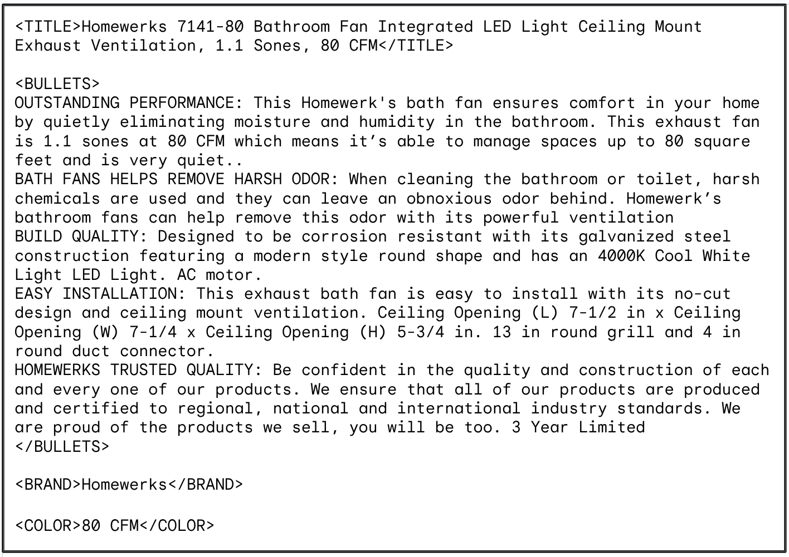

# text embeddings for product retrieval

Use text embeddings to represent both queries and products, and perform dot product to get the most similar products given a query.

## Datasets

We use two datasets

- the [esci](https://github.com/amazon-science/esci-data) Spanish dataset

- the [esci](https://github.com/amazon-science/esci-data) English dataset

- the [wands](https://github.com/wayfair/WANDS) dataset which is in English

The following tables summarizes the datasets

|   | wands  | esci-es  | esci-us  |
|---|---|---|---|
|num_products | 42994 | 259973 | 1215851 |
|num_queries | 480 | 15180 | 97345 |
|num_relevance_judgements | 233448 | 356410 | 1818825 |
| mean_num_relevance_judgements_per_query | 486.35 | 23.47892 | 18.684319 \

|relevance|label| pct of judgements|
|---|---|---|
|2 |Exact |    0.109720|
|1 |Partial|    0.628118|
|0 |Irrelevant|    0.262161|

[esci](https://github.com/amazon-science/esci-data) provides four relevance judgements

|relevance|label|esci-us|esci-es|
|---|---|---|---|
|4 | Exact |   0.566948 | 0.685914
|3 | Substitute |  0.057526 | 0.022019
|2 | Complemente |  0.249878  | 0.203050
|1 | Irrelevant |   0.125647 | 0.089016

## Results

 We use binary relevance, considering in `wands` other than relevance 2 as not relevant, and in `esci-us` and `esci-es` other than relevance 4 as not relevant.

With [`sklearn ndcg_score`](https://scikit-learn.org/stable/modules/generated/sklearn.metrics.ndcg_score.html), using the inverse ranking given by dot product similarity as `y_score`

|	| wands|	esci-es	|esci-us|
|---|---|---|---|
|openai	|0.615339|	0.676370|	|0.623495|
|text-exp0307|	0.637729	|0.696486	|0.650716|
|text-004	|0.618541	|0.554086	|0.605527|

Results with Google `text-embedding-004`, embedding size 768

## retrieval inspection on full experiments

The dataset has nice annotations but there seems to be many not-annotated products that may also be relevant to queries. This affects the **full** experiments which do retrieval in the full product space. In the following three query examples there are many products that clearly match the query but have not been identified as relevant. Comparisons between models in this sense have to be interpreted with care. 

## product embeddings

Products are described by the following fields `product_id`, `product_title`, `product_description`, `product_bullet_point`, `product_brand` and `product_color`. All products have id and title, but many are missing one or more of the other fields. Existing fields are concatenated with corresponding XML tags and then sent to generate embeddings. 

The following is an example of the string assembled for one random product

